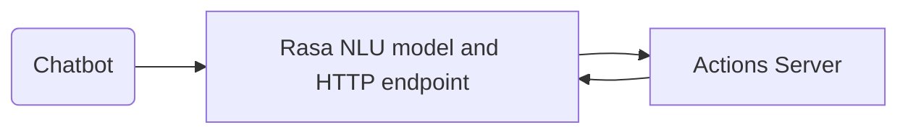

# 🤖 Rasa Backend for Ibentau Chatbot

This is a backend implementation for a chatbot using the open-source machine learning framework Rasa.

## ✨ Features

- [x] Ask for current or next talk in a specific room
  - **Example**: "Inform me about the next lecture in room A2"
  - **Response** : "The next talk in room A2 is 'Addressing students’ eco-anxiety when teaching sustainability in computing education' by John Doe, Joseph Doe on Monday, 01 January 2024 at 00:00:00."
- [x] Ask for the time and date a specific article is presented
  - **Example**: "When is the article Addressing students’ eco-anxiety when teaching sustainability in computing education presented?"
  - **Response** : "John Doe, Joseph Doe will present the article 'Addressing students’ eco-anxiety when teaching sustainability in computing education' on Monday, 01 January 2024 at 00:00:00 at location A2. You can find more information about the talk at https://example.com/talk.html."
- [x] Ask for the time and date a specific speaker is presenting
  - **Example**: "What time is the talk by John Doe?"
  - **Response** : "John Doe will be presenting the following talks:
    Ethical implications of artificial on Monday, 01 January 2018 at 00:00:00 in room A2
    Addressing students’ eco-anxiety when teaching sustainability in computing education on Monday, 01 January 2024 at 00:00:00 in room A2"
- [x] Ask for the conference schedule
  - **Example**: "When is the conference?"
  - **Response** : "The event has ended. It was held from Tuesday 01 January 2019 00:00:00 to Tuesday 01 January 2019 00:00:00"
- [x] Ask for the venue address
  - **Example**: "What is the address of the venue?"
  - **Response** : "The venue is located at Université de Rennes - Campus Beaulieu, 263 Av. Général Leclerc, 35000 Rennes. You can find it on Google Maps here: https://www.google.com/maps?q=Universit%C3%A9+de+Rennes+-+Campus+Beaulieu%2C+263+Av.+G%C3%A9n%C3%A9ral+Leclerc%2C+35000+Rennes"
- [x] Ask for restaurant recommendations
  - **Example**: "Where can I eat?"
  - **Response** : "Here is a list of restaurants near the venue (Université de Rennes - Campus Beaulieu, 263 Av. Général Leclerc, 35000 Rennes): https://www.google.com/maps/search/restaurants+near+Universit%C3%A9+de+Rennes+-+Campus+Beaulieu%2C+263+Av.+G%C3%A9n%C3%A9ral+Leclerc%2C+35000+Rennes"
- [x] Ask for things to do in the city
  - **Example**: "What are the things to see in this area?"
  - **Response** : "Here is a list of things to see near the venue (Université de Rennes - Campus Beaulieu, 263 Av. Général Leclerc, 35000 Rennes): https://www.google.com/maps/search/things+to+see+near+Universit%C3%A9+de+Rennes+-+Campus+Beaulieu%2C+263+Av.+G%C3%A9n%C3%A9ral+Leclerc%2C+35000+Rennes"


## Architecture

The backend consists of two parts: the Rasa NLU model and the Rasa actions server.



## 🛠️ Running the backend
### Train the model

Download a pretrained model from the GitHub artifacts and place it in the `models` folder.

Or 

To train the model, run the following command:

```bash
rasa train
```

### Run the action server

To start the actions server, run the following command in the root directory of the project:

```bash
rasa run actions
```

### Run the server

To start the backend server, run the following command in the root directory of the project:

```bash
export ACTION_SERVER=localhost
export ACTION_PORT=5055

rasa run --enable-api --cors "*"
```

This will start the server at http://localhost:5005.

## 👷‍ Usage

### Sending a message

To send a message to the chatbot, send a POST request to the `/webhooks/rest/webhook` endpoint with the following body:

```json
{
  "sender": "test",
  "message": "Hello"
}
```

The `sender` field is used to identify the user. The `message` field is the message that the user sent.

### Receiving a response

The response will be a JSON array with the following structure:

```json
[
  {
    "recipient_id": "test",
    "text": "Hello, how can I help you?"
  }
]
```

The `recipient_id` field is the same as the `sender` field in the request. The `text` field is the response from the chatbot.


## 📑 License

This project is licensed under the Apache License 2.0 - see the [LICENSE](LICENSE) file for details.
